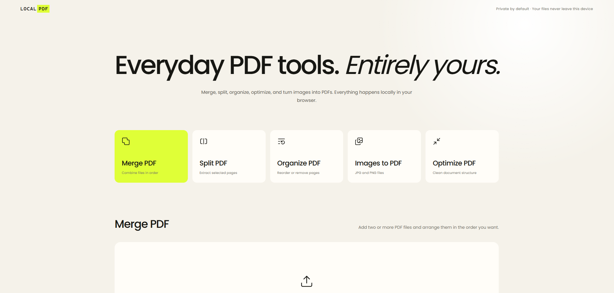

# LocalPDF



LocalPDF is a private, local-first PDF toolbox I made for everyday document tasks without uploading personal files to a website.

## Features

- Merge multiple PDFs
- Extract pages from a PDF
- Reorder or remove pages
- Convert JPG and PNG images into a PDF
- Losslessly optimize PDF structure
- Drag-and-drop interface
- Processing entirely inside the browser

## Run locally

Install [Node.js](https://nodejs.org/), then run:

```powershell
npm install
npm run dev
```

## Build

```powershell
npm run build
```

The production site is written to `dist` and can be served by any static web server.

## Privacy

Your files are read and processed locally by the browser. LocalPDF has no backend, accounts, analytics, or upload endpoint.

## Current limitations

- Encrypted or password-protected PDFs are not supported yet.
- Optimization rewrites PDF structure without reducing image quality. Strong compression of scanned PDFs will require a later image-rendering layer.
- Image conversion currently supports JPG and PNG.

## License

The source code and functionality are available under the [MIT License](LICENSE).

The LocalPDF user-interface design, visual styling, layout, and branding are excluded from the MIT license. They may be used for personal, non-commercial purposes only. You may not redistribute, publish, sell, or use the UI design in another public or commercial product without permission.

Interface icons are provided by [Lucide](https://lucide.dev/) under the ISC License.
