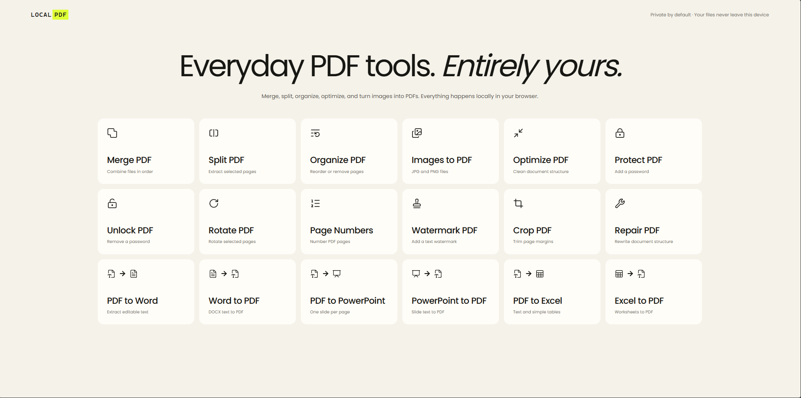

# LocalPDF



A private, local-first collection of everyday PDF tools I originally made for myself. Files are processed directly in your browser—they are never uploaded to a server.

## What it can do

### PDF tools

- Merge, split, organize, rotate, crop, optimize, and repair PDFs
- Convert JPG and PNG images into a PDF
- Add page numbers and text watermarks
- Protect PDFs with a password or unlock them using the current password

### Document conversions

- PDF ↔ Word (`DOCX`)
- PDF ↔ PowerPoint (`PPTX`)
- PDF ↔ Excel (`XLSX` / `XLS`)

Office conversions focus on readable, editable content. Complex layouts, fonts, charts, animations, images, and exact positioning may change or be omitted.

## Privacy

LocalPDF has no backend, accounts, analytics, upload endpoint, or runtime network requirement. Your documents stay on your device and are processed in browser memory.

## Run locally

Install [Node.js](https://nodejs.org/), then run:

```powershell
npm install
npm run dev
```

## Test and build

```powershell
npm test
npm run build
```

The production build is written to `dist` and can be hosted by any static web server.

## License

The source code and functionality are available under the [MIT License](LICENSE).

The LocalPDF user-interface design, visual styling, layout, and branding are excluded from the MIT License. They may be used for personal, non-commercial purposes only. You may not redistribute, publish, sell, or reuse the UI design in another public or commercial product without permission.

Interface icons are provided by [Lucide](https://lucide.dev/) under the ISC License.
